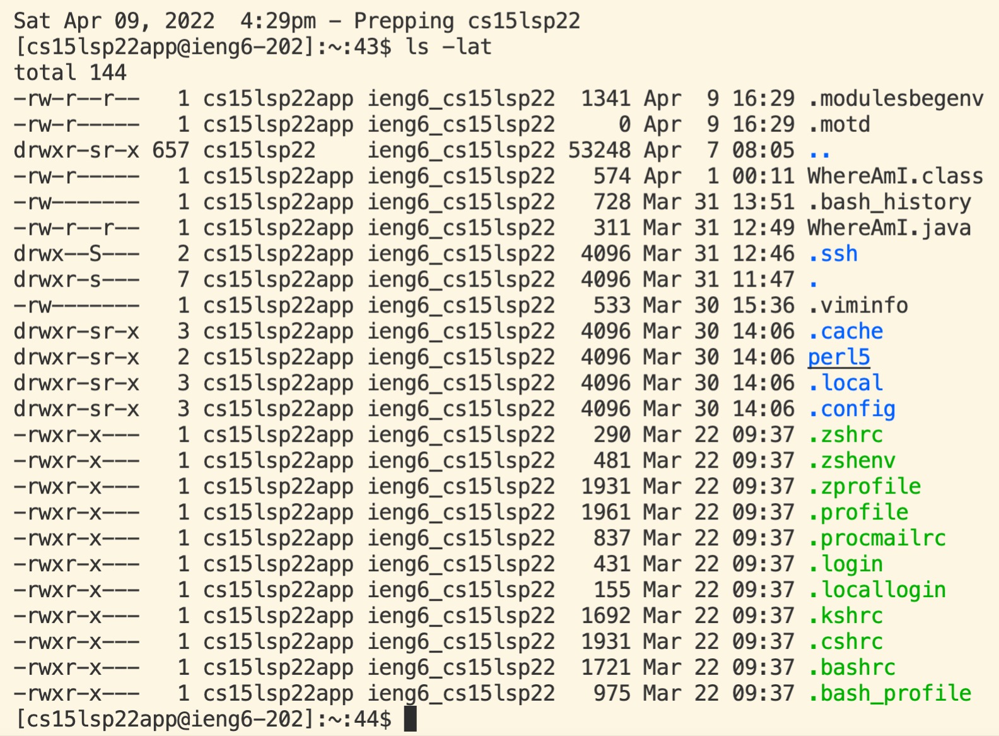
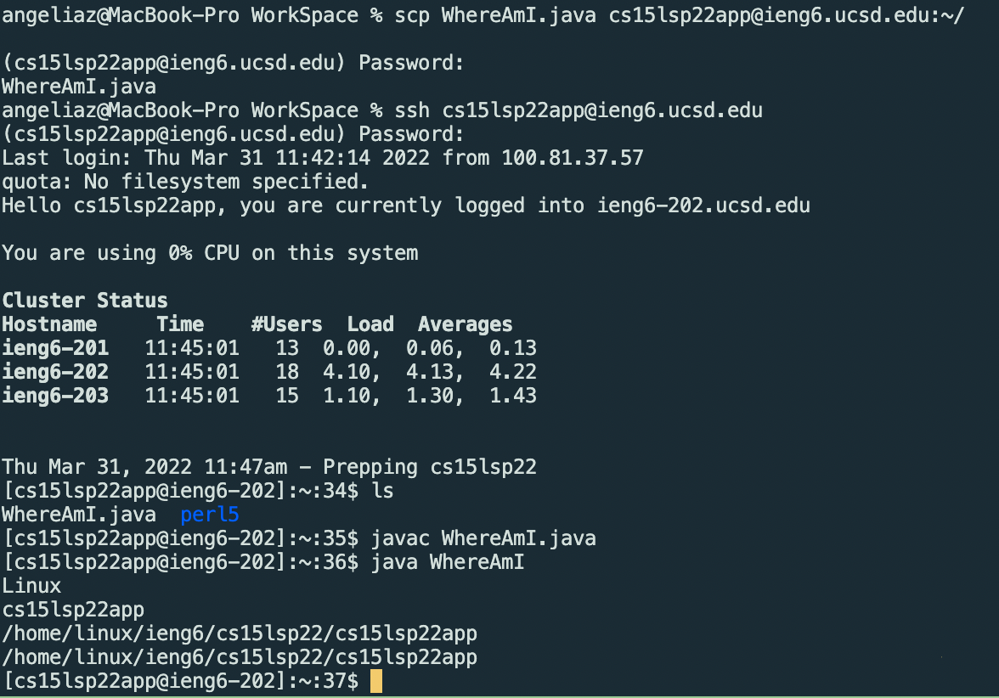
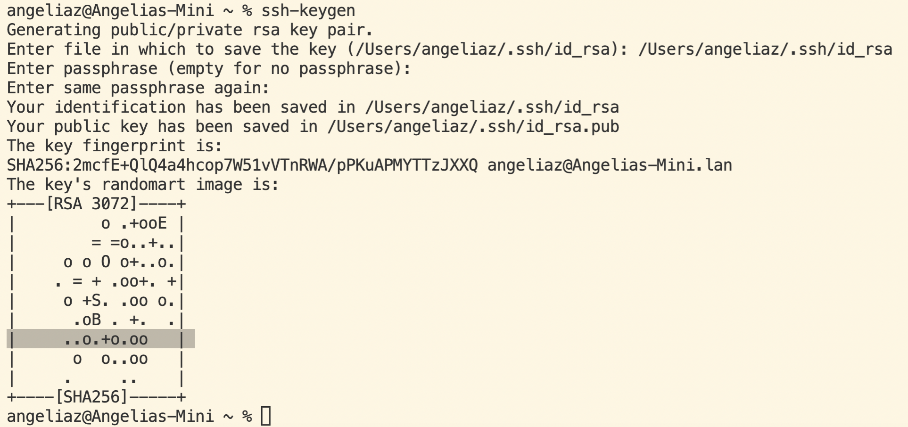

# CSE15L Tutorial

***By Angelia***

## Hello everyone, let's get starting with CSE15L today!

***
### Part 1 Install Visual Studio Code

* Go to [Visual Studio Code website](https://code.visualstudio.com).
* Follow the instruction to download and install the application on your computer.
* **important:** There are versions for all the major operating systems, like OSX (for Macs) and Windows (for PCs). Please make sure the version you download matching your computer.
* After installing, you should be able to open te window like this(there might be a little different on its appearance, dipending on your system and setting.)


### Part 2 Connect to a Remote Host

* Follow the instruction [How-to-Reset-your-Password.pdf](How-to-Reset-your-Password.pdf) to activate your CSE15L server account.
* For windows users, `install OpenSSH` on your computer before starting.
* Then start to connect to a remote host:
1. Open a terminal in VSCode.
2. Do the command like this:

`$ ssh cs15lsp22app@ieng6.ucsd.edu`
replace "app" with your special-course account.

3. You will probably recieve a message like this:

```

⤇ ssh cs15lsp22app@ieng6.ucsd.edu

The authenticity of host 'ieng6.ucsd.edu (128.54.70.227)' can't be established.

RSA key fingerprint is 
SHA256:ksruYwhnYH+sySHnHAtLUHngrPEyZTDl/1x99wUQcec.

Are you sure you want to continue connecting (yes/no/[fingerprint])?
```

Type yes and press enter.

4. Put in your password as required. You will have a view like this:


### Part 3 Run Some Commands

Now you are connecting with the remote host if you have finished every step. 

Let's _try_ some commands:

* `$ cd` (change direction)

* `$ ls -lat` (list all files)


* `$ ls <directory>` where `<directory>` is `/home/linux/ieng6/cs15lsp22/cs15lsp22abc`, where the abc is one of the other group members’ username.


* `$ cp` (copy)


* `$ cat` (create or view a file)


* Ctrl+D (exit)

### Part 4 Moving Files Over SSH with `scp`
* `scp`: _copy a file (or many files!) from your computer to a remote computer_

* Create a file called `WhereAmI.java` on your computer.

Content of `WhereAmI.java`:
```
class WhereAmI {
  public static void main(String[] args) {
    System.out.println(System.getProperty("os.name"));
    System.out.println(System.getProperty("user.name"));
    System.out.println(System.getProperty("user.home"));
    System.out.println(System.getProperty("user.dir"));
  }
}
```
* `$ scp WhereAmI.java cs15lsp22app@ieng6.ucsd.edu:~/`

Operate this step with the special-course account which you are logging.

* Do `javac WhereAmI.java` and `java WhereAmI` to run the file and then you will get this:

The result of `WhereAmI.java` shows that the location of the file is the remote computer you are logging.

### Part 5 Setting an SSH Key
* Run the followinng commands in your terminal after logging out of the remote:

**# on client (your computer) (or log out the remote)**

```
$ ssh-keygen

Generating public/private rsa key pair.

Enter file in which to save the key (/Users/angeliaz/.ssh/id_rsa): /Users/angeliaz/.ssh/id_rsa (`<user-name>`should be the name of your computer).

Enter passphrase (empty for no passphrase): (Do not type anything and press `enter` directly)

Enter same passphrase again: (Press `enter` directly)

Your identification has been saved in /Users/angeliaz/.ssh/id_rsa

Your public key has been saved in /Users/angeliaz/.ssh/id_rsa.pub

The key fingerprint is:

SHA256:2mcfE+QlQ4a4hcop7W51vVTnRWA/pPKuAPMYTTzJXXQ angeliaz@Angelias-Mini.lan
```

The key's randomart image is:

```

+---[RSA 3072]----+

|         o .+ooE |

|        = =o..+..|

|     o o O o+..o.|

|    . = + .oo+. +|

|      o S = *.B. |

|       = = O.*.*+|

|     ..o.+o.oo   |

|           +.+.o |

|             ..  |

+----[SHA256]-----+
```

You may have a picture like this:


* Now we need to copy the public key to `.ssh` directory of your user account on the server.

```
$ ssh cs15lsp22app@ieng6.ucsd.edu (log in you course account)

<Enter Password> (now on server)

$ mkdir .ssh (mkdir: make directory)

$ <logout> (back on client)

$ scp /Users/angeliaz/.ssh/id_rsa.pub cs15lsp22app@ieng6.ucsd.edu:~/.ssh/authorized_keys
```


### Part 6 Optimizing Remote Running

Now log out the remote server and do:

* `$ cp WhereAmI.java OtherMain.java; javac OtherMain.java; java WhereAmI`

* `$ ssh cs15lsp22app@ieng6.ucsd.edu "ls"`


* `$ scp WhereAmI.java cs15lsp22app@ieng6.ucsd.edu:~/`

* `$ ssh cs15(sp22app@ieng6.ucsd.edu "javac WhereAmI.java; iava WhereAmI"`

**Here's some examples when you run the commands above.
Now you can run several commands in one line, and operate files on the remote server without log-in and putting in password.**


_Save you time!_

_-The End-_

_-Thank you!-_

[Back To Main](https://angeliazddl.github.io/CSE15L_Lab_Report/)