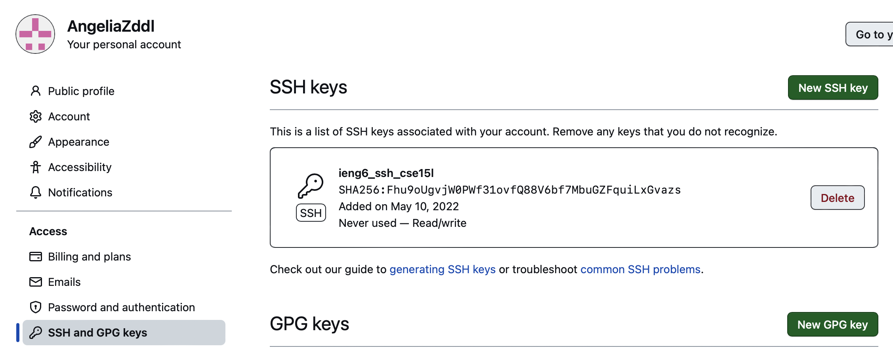
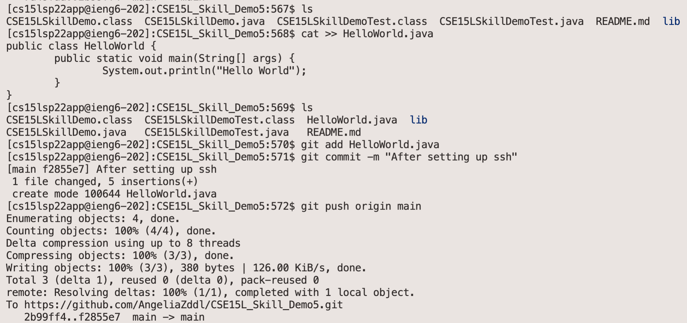

# CSE15L_Lab_Report3

## Group Choice 1 – Streamline ssh Configuration

### `.ssh/config` and `ssh` command.

**I changed the name(after Host) to `Angelia` and then I can use `ssh Angelia` to log in the remote server.**

## `scp` Command

**Now I can use some command with the name I set.**

***You may change that name to whatever you like!***

## Group Choice 2 – Setup Github Access from ieng6

### Public Key
**Here's the ssh stored on Github**

**Matching the key in my account**

### Private Key
**This is the private token created and copied from Github. I stord it on the remote server by `git config --global credential.helper store`.**

### Running `git` Command While Logging Into ieng6 Account

### Link for the Resulting Commit
[CSE15L_Skill_Demo5](https://github.com/AngeliaZddl/CSE15L_Skill_Demo5/)

***Now it's no needs to put in the password every time while committing and pushing.***

## Group Choice 3 – Copy Whole Directories with `scp -r`

### Copying your whole markdown-parse directory

### Logging into your ieng6 account after doing this and compiling and running the tests for your repository

**I made some changes for this file, deleting the .png files and then commit and push the changes to the origin main.**

### Combining `scp`, `;`, and `ssh`: copy the whole directory and run the tests in one line

[Back to Main](https://angeliazddl.github.io/CSE15L_Lab_Report/)