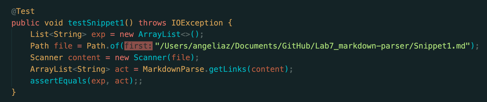
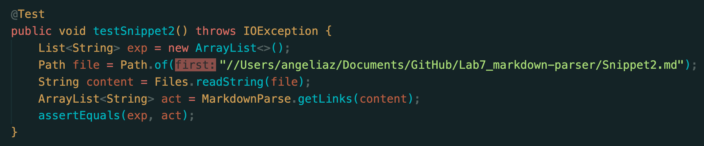
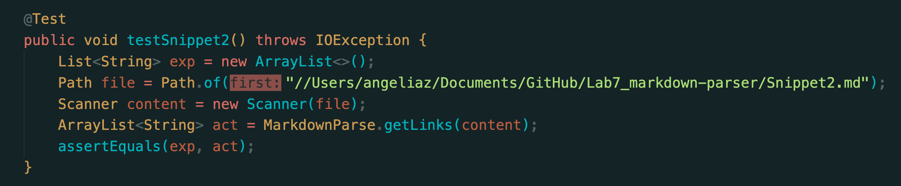
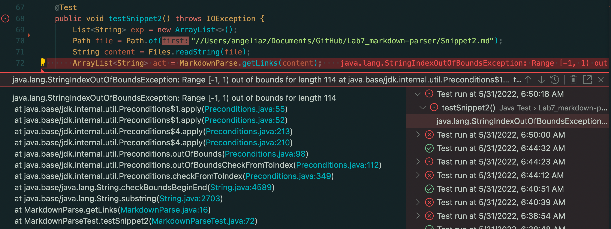
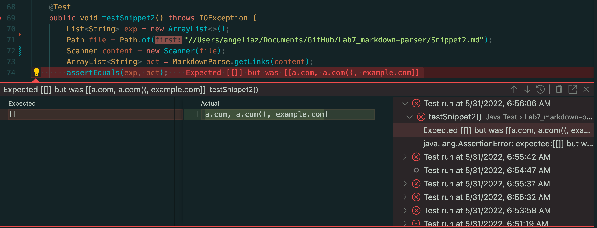
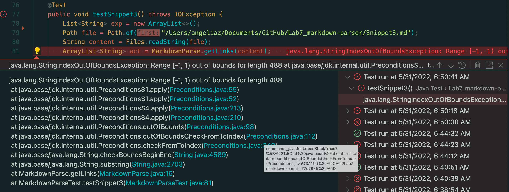

# CSE15L_Lab_Report4

The ***[link](https://github.com/AngeliaZddl/Lab7_markdown-parser)*** to markdown-parse repository

The ***[link](https://github.com/mv5903/markdown-parser)*** to the one reviewed in week 7

## Snippet 1

### Preview

### Test Code On My Own `markdown-parser`

### Test Code On The Lab7 Reviewed `markdown-parser`

### Running Result for On My Own `markdown-parser`
Not pass since the reason below:

### Running Result for The Lab7 Reviewed `markdown-parser`
Not pass since the reason below:

## Snippet 2

### Preview

### Test Code On My Own `markdown-parser`

### Test Code On The Lab7 Reviewed `markdown-parser`

### Running Result for On My Own `markdown-parser`
Not pass since the reason below:

### Running Result for The Lab7 Reviewed `markdown-parser`
Not pass since the reason below:

## Snippet 3

### Preview

### Test Code On My Own `markdown-parser`

### Test Code On The Lab7 Reviewed `markdown-parser`

### Running Result for On My Own `markdown-parser`
Not pass since the reason below:

### Running Result for The Lab7 Reviewed `markdown-parser`
Not pass since the reason below:

## Question 1:

*Do you think there is a small (<10 lines) code change that will make your program work for snippet 1 and all related cases that use inline code with backticks? If yes, describe the code change. If not, describe why it would be a more involved change.*

### Answer: 
Yes, I would add if conditional sentence to check if the form of the link is correct. As the preview shows, if the link does not have a pair of `[` and `]` outside of a pair of the grave (`), then don't print the link.
For example,  there is no close bracket before the grave symbol, so it is not a correct form for a link and then don't print it.

## Question 2:

*Do you think there is a small (<10 lines) code change that will make your program work for snippet 2 and all related cases that nest parentheses, brackets, and escaped brackets? If yes, describe the code change. If not, describe why it would be a more involved change.*

### Answer:
Yes, I would add a for-loop and if conditional sentence to check if the content in a pair of bracket is a nested link. If a `(` is next to `(` or `)` and a `)` next to `)` or `(`, then it is a nested parenthesized link. If there is a pair of bracket with `\` inside of a pair of bracket, then it is escaped brackets

## Question 3:

*Do you think there is a small (<10 lines) code change that will make your program work for snippet 3 and all related cases that have newlines in brackets and parentheses? If yes, describe the code change. If not, describe why it would be a more involved change.*

### Answer: 
No, this case contains more than one tough exception. Firstly, I would add if conditional sentences to check `returns` inside a pair of brackets and parenthesis while the title of link is too long and take more than one line. Secondly, I would add for-loop and if conditional sentences to check if there's a close parenthesis.

## Explanation:

[Back To Main](https://angeliazddl.github.io/CSE15L_Lab_Report/)