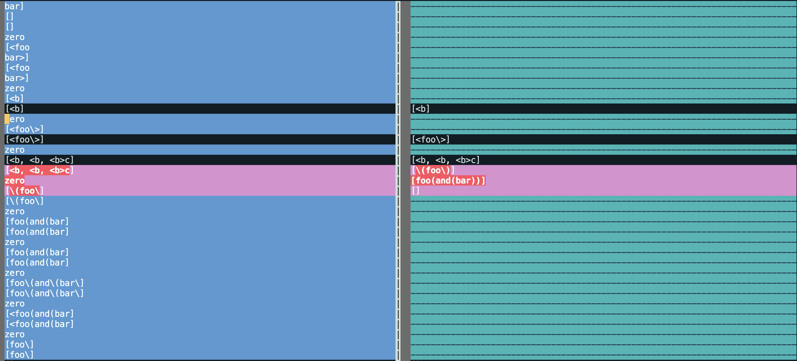

# CSE15L_Lab_Report5

## How you found the tests with different results:

## Answer: 
I used vimdiff on the results of running a bash for loop on the remote Lunix, like the picture below:

## The [link](https://github.com/AngeliaZddl/Lab7_markdown-parser/tree/main/test-files) to the test-file with two chosen different-results.

[Back To Main](https://angeliazddl.github.io/CSE15L_Lab_Report/)