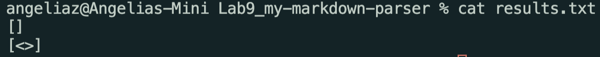
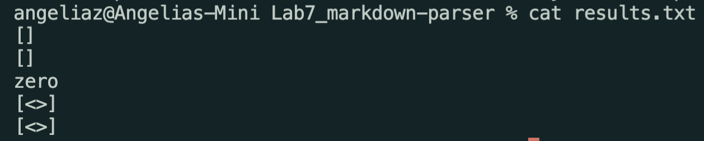
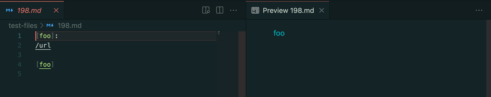
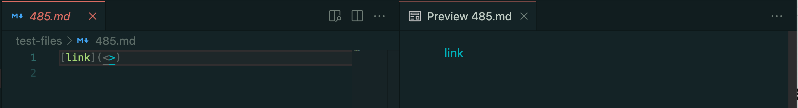
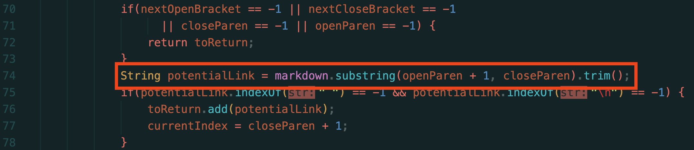

# CSE15L_Lab_Report5

## How you found the tests with different results:

## Answer: 
I used vimdiff on the results of running a bash for loop on the remote Lunix, like the picture below:


## The [link](https://github.com/AngeliaZddl/Lab7_markdown-parser/tree/main/test-files) to the test-file with two chosen different-results.

## For the Test `198.md` and the Test `485.md`:

### For each test:

**Both the `MarkdownParser.java` from the lab9 provided code and the lab7 team code give the wrong output on `485.md`. The lab9 provided `MarkdownParser.java` gives the correct output but the one from the lab7 gives wrong.**

### The actual outputs from lab9:




### The actual outputs from lab7:



### The expected outputs for `198.md` and `485.md`:
```
[]
[]
```

### The Preview:



***Even though `foo` and `link` are shown as links, which are highlighted in blue in the preview pictures, they are not the links that we are looking for in `MarkdownParser`. The correct output would simply be an empty array list for each.***

### Fix the code from the lab9 on the test `485.md`:
**The `MarkdownParser.java` from the lab9 does not check if the content between an open parenthesis and a close parenthesis is a link or just meaningless symbols. It prints out the content in the parentheses as a link, even though it is not an actual link. As the usual form of a link, it is not supposed to start with `<` or other symbols, so the simplest method to fix this bug is checking if the character next to the open parenthesis is a symbol: adding `if` conditional sentence before get the `potentialLink`, where is after the line 73 and before the line 74. If it is a symbol, then skip to the next line.**

### The line to fix in `MarkdownParser.java` from lab9:



***Thank you***

[Back To Main](https://angeliazddl.github.io/CSE15L_Lab_Report/)