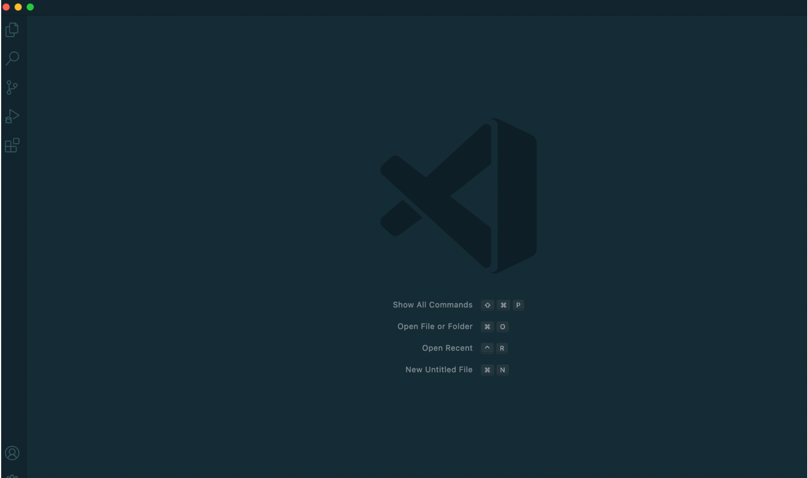

# CSE15L Tutorial

***By Angelia***

## Hello everyone, let's get starting with CSE15L today!

***
**Part 1 Install Visual Studio Code**

* Go to [Visual Studio Code website](https://code.visualstudio.com).
* Follow the instruction to download and install the application on your labtop.
* **important:** There are versions for all the major operating systems, like OSX (for Macs) and Windows (for PCs). Please make sure the version you download matching your computer.
* After installing, you should be able to open te window like this(there might be a little different on its appearance, dipending on your system and setting.)

**Part 2 Connect to a Remote Host**

* Follow the instruction [How-to-Reset-your-Password.pdf](How-to-Reset-your-Password.pdf) to activate your CSE15L server account.
* For windows users, `install OpenSSH` on your computer before starting.
* Then start to connect to a remote host:
1. Open a terminal in VSCode.
2. Do the command like this:

 `$ ssh cs15lsp22app@ieng6.ucsd.edu`
replace "app" with your special-course account.

3. You will probably recieve a message like this:

`⤇ ssh cs15lsp22app@ieng6.ucsd.edu`

`The authenticity of host 'ieng6.ucsd.edu (128.54.70.227)' can't be established.`

`RSA key fingerprint is` 
`SHA256:ksruYwhnYH+sySHnHAtLUHngrPEyZTDl/1x99wUQcec.`

`Are you sure you want to continue connecting (yes/no/[fingerprint])?`

Type yes and press enter.

4. Put in your password as required. You will have a view like this:

**Part 3 Run Some Commands**

Now you are connecting with the remote host if you have finished every step. 

Let's _try_ some commands:

* `$ cd` (change direction)
* `$ ls -lat` (list all files)

* `$ ls <directory>` where `<directory>` is `/home/linux/ieng6/cs15lsp22/cs15lsp22abc`, where the abc is one of the other group members’ username.

* `$ cp` (copy)

* `$ cat` (create or view a file)

* Ctrl+D (exit)

**Part 4 Moving Files Over SSH with `scp`**
* `scp`: _copy a file (or many files!) from your computer to a remote computer_
* Create a file called `WhereAmI.java` on your computer.

Content of `WhereAmI.java`:

`class WhereAmI {
  public static void main(String[] args) {
    System.out.println(System.getProperty("os.name"));
    System.out.println(System.getProperty("user.name"));
    System.out.println(System.getProperty("user.home"));
    System.out.println(System.getProperty("user.dir"));
  }
}`

* `$ scp WhereAmI.java cs15lsp22app@ieng6.ucsd.edu:~/`

Operate this step with the special-course account which you are logging.

* Do `javac WhereAmI.java` and `java WhereAmI` to run the file and then you will get this:

The result of `WhereAmI.java` shows that the location of the file is the remote computer you are logging.

**Part 5 Setting an SSH Key**
* Run the followinng commands in your terminal after logging out of the remote:

`# on client (your computer)` (or log out the remote)

`$ ssh-keygen`

`Generating public/private rsa key pair.`

`Enter file in which to save the key (/Users/angeliaz/.ssh/id_rsa): /Users/angeliaz/.ssh/id_rsa` (`<user-name>`should be the name of your computer).

`Enter passphrase (empty for no passphrase):` (Do not type anything and press `enter` directly)

`Enter same passphrase again:` (Press `enter` directly)

`Your identification has been saved in /Users/angeliaz/.ssh/id_rsa`

`Your public key has been saved in /Users/angeliaz/.ssh/id_rsa.pub`

`The key fingerprint is:`

`SHA256:2mcfE+QlQ4a4hcop7W51vVTnRWA/pPKuAPMYTTzJXXQ angeliaz@Angelias-Mini.lan`

`The key's randomart image is:`

`+---[RSA 3072]----+`

`|         o .+ooE |`

`|        = =o..+..|`

`|     o o O o+..o.|`

`|    . = + .oo+. +|`

`|      o S = *.B. |`

`|       = = O.*.*+|`

`|     ..o.+o.oo   |`

`|           +.+.o |`

`|             ..  |`

`+----[SHA256]-----+`

You may have a picture like this:

* Now we need to copy the public key to `.ssh` directory of your user account on the server.

`$ ssh cs15lsp22app@ieng6.ucsd.edu` (log in you course account)

`<Enter Password>` (now on server)

`$ mkdir .ssh` (`mkdir`: make directory)

`$ <logout>` (back on client)

`$ scp /Users/angeliaz/.ssh/id_rsa.pub cs15lsp22app@ieng6.ucsd.edu:~/.ssh/authorized_keys`

**Part 6 Optimizing Remote Running**

Now log out the remote server and do:
* `$ cp WhereAmI.java OtherMain.java; javac OtherMain.java; java WhereAmI`

* `$ ssh cs15lsp22app@ieng6.ucsd.edu "ls"`

* `$ sp WhereAmI.java cs15lsp22app@ieng6.ucsd.edu:~/`

* `ssh cs15(sp22app@ieng6.ucsd.edu "javac WhereAmI.java; iava WhereAmI"`

_Save you time!_

$-The$ $End-$

$-Thank$ $you!-$